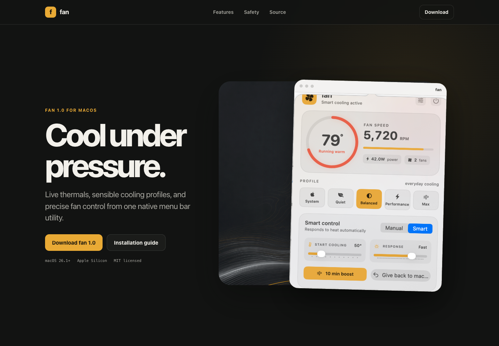
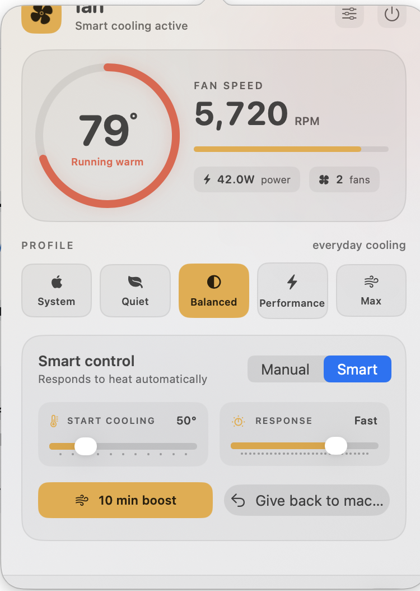

<p align="center">
  
</p>

<p align="center">
  <a href="https://lordydord.github.io/fan/"><strong>Product site</strong></a>
  &nbsp;&nbsp;|&nbsp;&nbsp;
  <a href="https://github.com/lordydord/fan/releases/latest"><strong>Download</strong></a>
  &nbsp;&nbsp;|&nbsp;&nbsp;
  <a href="docs/README.md"><strong>Documentation</strong></a>
</p>

<p align="center">
  
  
  
  
</p>

# Fan App

Fan App is a native macOS menu bar utility for reading live thermal data and taking deliberate control of fan speed. It keeps the essential numbers visible, offers sensible cooling profiles, and always provides a direct route back to macOS system control.

## The useful parts, immediately

- **Live thermal telemetry** for CPU temperature, fan RPM, fan count, and battery power draw.
- **Five practical profiles**: System, Quiet, Balanced, Performance, and Max.
- **Smart control** with adjustable cooling threshold and response.
- **Manual control** for a precise fixed RPM.
- **10 minute boost** for short renders, exports, and other sustained loads.
- **Menu bar readout** for temperature, fan percentage, power, or icon-only mode.
- **Thermal safeguards** including emergency maximum speed and automatic restoration on exit.
- **Local by design** with no account, analytics, advertising, or network telemetry.

<p align="center">
  
</p>

## Install Fan App 1.1.3

1. Download `fan-1.1.3-macos.dmg` from the [latest release](https://github.com/lordydord/fan/releases/latest).
2. Open the disk image and drag `fan.app` into Applications.
3. Right-click `fan.app` and choose **Open** on first launch.
4. Choose **Install helper** inside fan and enter an administrator password once.

The v1.1.3 download is ad-hoc signed and built for Apple Silicon. macOS may show the standard warning for independently distributed apps.

### One-command install

```bash
curl -fsSL https://raw.githubusercontent.com/lordydord/fan/main/scripts/install.sh | bash
```

The script downloads the latest GitHub release, installs the app, installs the narrowly scoped SMC helper, and launches fan.

## Requirements

- macOS 26.1 or later
- Apple Silicon for the supplied v1.1.3 binary
- Administrator approval for fan-speed control
- A Mac that exposes compatible SMC fan and temperature keys

Temperature and fan availability differ by Mac model. The interface reports missing readings rather than inventing values.

## Safety model

macOS protects SMC writes. `fan` uses a small helper installed at `/usr/local/bin/smc-helper` for validated fan commands only. The main app does not run as root.

- Fan targets are clamped to safe hardware limits.
- Smart mode increases cooling as temperatures rise.
- Emergency protection can force maximum fan speed.
- Sleep, lock, exit, and process failure return control to macOS.
- A watchdog restores automatic control if the app stops unexpectedly.

Read [SECURITY.md](SECURITY.md) before installing the helper or reviewing the threat model.

## Build from source

```bash
git clone https://github.com/lordydord/fan.git
cd fan
xcodebuild \
  -project fan.xcodeproj \
  -scheme fan \
  -configuration Debug \
  -destination 'platform=macOS' \
  CODE_SIGNING_ALLOWED=NO \
  build
```

For the local Codex run action:

```bash
./script/build_and_run.sh --verify
```

Policy tests run independently with Swift Package Manager:

```bash
swift test
```

## Project map

```text
fan/App                 App lifecycle and menu bar popover
fan/Core                SMC monitoring, policies, fan control, safety
fan/UI                  SwiftUI popover and settings interface
fanPolicyTests          Deterministic thermal-policy tests
tools/fan-watchdog      Crash and exit restoration watchdog
tools/smc-helper        Narrow privileged SMC command helper
docs                    GitHub Pages site and product documentation
```

## Version 1.1.3

This release corrects Smart control so Maximum response means stronger cooling above the target—not permanent maximum RPM. Fans now return toward minimum speed once the Mac reaches or falls below the selected temperature.

See the full [Fan App 1.1.3 release notes](docs/release-notes/v1.1.3.md).

## Contributing

Focused fixes, Mac-model compatibility reports, sensor-key research, and accessibility improvements are welcome. Start with [CONTRIBUTING.md](CONTRIBUTING.md).

## License

MIT. See [LICENSE](LICENSE).
